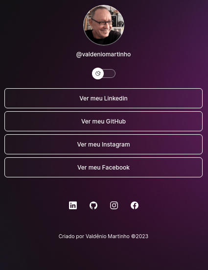
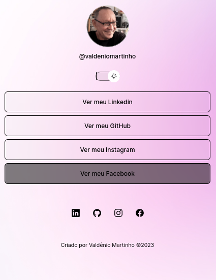

<h1 align="center">Project Dev Links</h1>

  <a href="#-tecnologias">Tecnologias</a>&nbsp;&nbsp;&nbsp;|&nbsp;&nbsp;&nbsp;
  <a href="#-projeto">Projeto</a>&nbsp;&nbsp;&nbsp;|&nbsp;&nbsp;&nbsp;
  <a href="#memo-licença">Licença</a>

 

  &nbsp;
  

## :rocket: Tecnologias

Esse projeto foi desenvolvido com as seguintes tecnologias:

- HTML
- JavaScript
- CSS
- Git e GitHub
- Figma

## 💻 Projeto

O DevLinks é um agregador de links para usar como cartão de visitas online.

## Layout

Você pode conferir o projeto funcionando neste link:
<a href="" target="_blanck">DevLinks</a>

## 📝 Licença:
Esse projeto está sob licença MIT.

  

